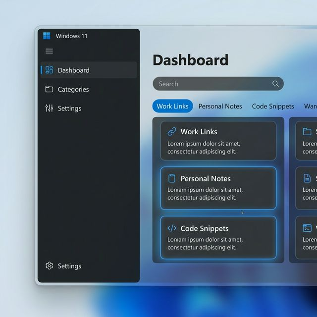
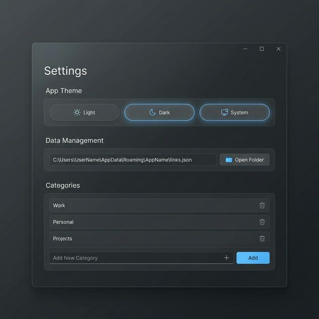

# Links & More

A modern WPF application built with .NET 10 and WPF-UI, designed to help you organize and manage your links and more.

## Features



- **Modern Dashboard**: A clean, organized view of all your saved content using Windows 11 Fluent Design.
- **Content Types**:
  - 🔗 **Links**: Save URLs for quick access with one-click opening.
  - 📝 **Notes**: Store important text and thoughts.
  - 💻 **Snippets**: Keep code or text snippets ready to copy.
- **Smart Categorization**: Group your links and notes into custom categories (e.g., Work, Personal, Dev).
- **Instant Search**: Real-time filtering of all items by title or content as you type.



- **Quick Actions**: 
  - One-click **Open** for links.
  - One-click **Copy to Clipboard** for notes and snippets.
  - Easy **Edit** and **Delete** functionality.
- **Customizable Themes**: Full support for Light and Dark modes, or sync with your Windows System theme.
- **Data Management**:
  - Local JSON storage (privacy-focused).
  - Easily find and manage your data file path via Settings.
- **Performance**: Optimized for speed with virtualization for large collections of items.

## Getting Started

### Prerequisites
- [dotnet 10 SDK](https://dotnet.microsoft.com/download/dotnet/10.0)
- Visual Studio 2026 (recommended)

### Installation
1. Clone the repository:
   ```bash
   git clone https://github.com/ian-cowley/LinksAndMore-.git
   ```
2. Open `LinksAndMore.sln` in Visual Studio.
3. Build and run the project.

## Technologies
- **Framework**: .NET 10.0
- **UI Library**: WPF-UI
- **MVVM**: CommunityToolkit.Mvvm

## Development
To build the project from the command line:
```bash
dotnet build
```

## License
This project is licensed under the MIT License - see the [LICENSE](LICENSE) file for details.
